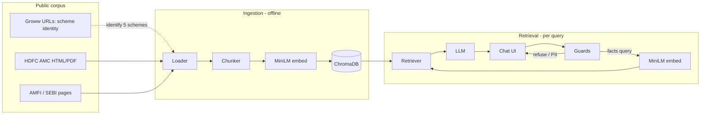
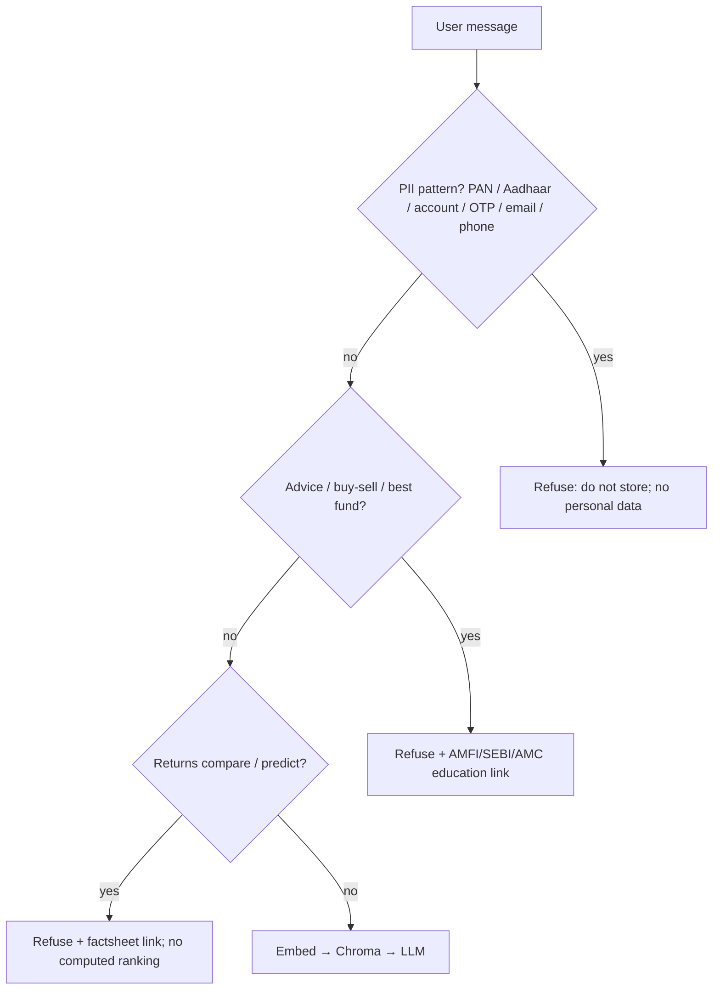
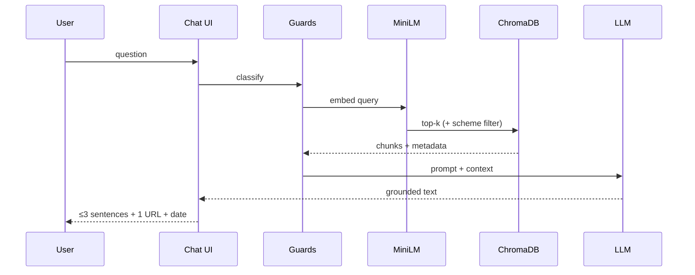

# Architecture

**Product:** Growbot — Mutual Fund Facts-Only FAQ Assistant  
**Type:** Class-demo RAG chatbot  
**Version:** 1.0  
**Date:** 27 September 2026  
**Source:** `docs/PRD.md`

This document describes **how** Growbot is built. Product rules (facts-only, citations, corpus scope) live in the PRD. The architecture must keep **data ingestion** and **data retrieval** as separate stages so the class demo can walk the full RAG path.

---

## 1. Design goals

| Goal | Architectural implication |
|------|---------------------------|
| Show every RAG stage | Pipelines are explicit modules, not one “magic” function |
| Grounded answers + one citation | Generation sees only retrieved chunks; URL comes from chunk metadata |
| Five similar HDFC schemes | Chunk prefix + metadata filter by `scheme_name` |
| No advice, no PII, no return math | Guard layer **before** retrieval/generation; refuse without calling the LLM when possible |
| Demo-friendly | Local Chroma persist, one-command reindex, single-page UI, no auth |

**Default stack (class demo):**

| Layer | Choice |
|-------|--------|
| UI | Lightweight chat page (Streamlit or Gradio; FastAPI + HTML is equivalent) |
| Ingestion | Python scripts / package (`ingest`) |
| Embeddings | `sentence-transformers/all-MiniLM-L6-v2` |
| Vector DB | ChromaDB (persistent local directory) |
| Generation | Small chat LLM (local or API); documented in README |
| Guardrails | Deterministic classifiers + prompt policy |

---

## 2. System context



Groww seed URLs **identify** the five Direct Growth schemes. Indexed documents are **official AMC / AMFI / SEBI** pages. Groww HTML is not the default corpus.

---

## 3. Two RAG stages

Ingestion and retrieval do not share a request path. Ingestion writes Chroma; retrieval only reads it.

```
INGESTION (batch, rebuildable)          RETRIEVAL (online, per question)
─────────────────────────────────       ─────────────────────────────────
1. Loading                              5. Query embed (same MiniLM)
2. Chunking                             6. Vector search in ChromaDB
3. Embedding                            7. Context assembly
4. Store vectors + metadata             8. Generate + cite + refuse if needed
```

---

## 4. Logical components

```
growbot/
  data/
    sources.csv          # auditable URL list
    chroma/              # persisted collection (gitignored)
  docs/                  # PRD, architecture, sample Q&A
  src/growbot/
    ingest/
      load.py            # fetch, clean, metadata
      chunk.py           # structure-aware split
      embed.py           # MiniLM
      index.py           # write Chroma
    retrieve/
      query.py           # embed query, search, optional scheme filter
      assemble.py        # top-k context + citation pick
    generate/
      prompt.py          # grounded facts-only system prompt
      answer.py          # LLM call → ≤3 sentences + source + date
    guards/
      intent.py          # advice / performance / PII
    ui/
      app.py             # welcome, 3 examples, disclaimer, chat
```

Names can vary; **stage boundaries must stay visible** in the repo.

---

## 5. Stage 1 — Data ingestion

Run offline (CLI: `python -m growbot.ingest` or equivalent). Re-running **replaces** the collection so the demo stays reproducible.

### 5.1 Loading

**Input:** `data/sources.csv` (or Markdown source list) with at least five primary URLs plus optional statement/tax **guides**.

**Process:**

1. Fetch HTML and/or PDF (factsheet / KIM / SID).
2. Strip nav, footers, cookie banners; keep scheme facts and how-to text.
3. Prefer HTML fee/scheme pages over messy PDF tables when both exist.
4. Attach document-level metadata (see §7).

**Output:** list of `Document { text, metadata }`.

### 5.2 Chunking

Corpus is short, headed, and fact-dense. Chunks must keep **label + value** together (do not split “expense ratio” from “1.05%”).

**Algorithm: structure-aware recursive split, then size cap.**

1. Split on headings, then blank lines, then sentences: `\n## `, `\n### `, `\n\n`, `. `.
2. Target **400–512 characters** per chunk (~80–120 MiniLM tokens).
3. **Overlap: 80 characters.**
4. If an exit-load (or similar) table exceeds the cap, **do not split mid-row**; keep the table block as one chunk.
5. Prefix every chunk: `{scheme_name} | {section}`.

**Why this size:** five schemes share templates. Large chunks mix funds; tiny chunks lose what the number means.

### 5.3 Embedding

- Model: `sentence-transformers/all-MiniLM-L6-v2`
- Embed **chunks only**, not full pages
- Dimension: 384
- Same model instance/config as query-time embedding
- Runtime: `config.EMBEDDING_BACKEND`, default `onnx` — see §5.5

### 5.5 Embedding runtime (memory)

`EMBEDDING_BACKEND` selects which engine executes the encoder. Both load the
same weights and produce the same 384-d vector, so the choice is a memory
decision, not a behaviour one.

| backend | engine | measured peak RSS, one `ask()` |
|---|---|---|
| `onnx` (default) | onnxruntime via chromadb's `ONNXMiniLM_L6_V2` | **238.7 MB** |
| `torch` | sentence-transformers | 579.7 MB |

Torch costs ~500 MB of runtime to evaluate a 22M-parameter model. onnxruntime
is already a chromadb dependency, so the default costs no additional package.

Equivalence is measured, not assumed: cosine **1.0000000000**, max elementwise
difference **1.6e-07**, `allclose(atol=1e-5)`, in the raw un-normalised form
`embed_texts` uses. That is float32 rounding — far below the precision
`SIMILARITY_FLOOR` is specified to — so switching backends cannot move a score
across the floor and **does not require re-ingesting the corpus**.
`retrieve.checks` re-measures it on every run and exits non-zero on drift;
perturbing the encoder by 0.5% was confirmed to fail the suite.

Rejected alternatives, so they are not re-tried:

- `sentence_transformers(..., backend="onnx")` — requires `optimum` (not
  otherwise needed), downgraded sentence-transformers 6.1.0 → 5.7.0, and still
  imported torch. Measured 552.9 MB, i.e. *more* than plain torch.
- `OMP_NUM_THREADS=1` / `torch.set_num_threads(1)` — saved 1 MB. Thread arenas
  are not the cost.
- fp16 weights — saved 38 MB but made encoding 4.5× slower (105 ms vs 23 ms)
  with fifth-decimal drift.

Guard: chroma's onnx encoder implements `all-MiniLM-L6-v2` only (its
constructor takes no model argument), so a custom `EMBEDDING_MODEL` combined
with `onnx` falls back to torch in `_load_onnx` rather than silently encoding
every chunk with MiniLM while `config` reported a different model.

### 5.4 Store in ChromaDB

- Persistent client, local dir (e.g. `data/chroma`)
- Collection: e.g. `hdfc_mf_faq`
- Each item: `id`, `embedding`, `document` (chunk text), `metadata`
- `source_url` is mandatory on every record (citation)

**Rebuild:** delete collection or directory, then ingest from `sources.csv` again.

---

## 6. Stage 2 — Data retrieval and generation

Per user message, after guards pass.

### 6.1 Query embed

Embed the raw question with the **same** MiniLM model. Optionally append detected `scheme_name` to the query string for better alignment.

**Resolution of an underspecified follow-up.** If the question names no scheme,
a bounded window of prior turns may supply one (§6.5). When it does, the
scheme name *is* appended to the query, which is §6.1's option applied only
where the question names no fund. The two are not in conflict: the general case
stays off because appending there matched chunk prefixes rather than content,
whereas an underspecified question has no fund-specific text at all and the
`general` explainer wins by default.

### 6.2 Vector search

- Metric: cosine (Chroma default for these embeddings)
- **top-k = 3–5**
- If the query names a scheme, **metadata filter** `scheme_name == <detected>` (or equivalent where-clause). If filter returns empty, fall back to unfiltered top-k (then the generator must still refuse if mixed/weak).

### 6.3 Context assembly

Build a context block:

```
[1] {scheme} | {section}
{chunk text}
source: {source_url}
fetched_at: {fetched_at}

[2] ...
```

**Citation rule:** exactly **one** URL in the user-facing answer — the `source_url` of the **highest-scoring chunk that supports the stated fact**. Do not invent URLs. Do not list all k links.

**Last updated:** `Last updated from sources: YYYY-MM-DD` from that chunk’s `fetched_at` or document date.

**Weak retrieval:** if max similarity is below a threshold (tune in implementation; start ~0.35–0.45 cosine) **or** chunks contradict / name a different scheme, skip generation of a fact and refuse.

### 6.4 Generate

LLM receives:

- System policy: facts only; use context only; ≤ 3 sentences; no buy/sell; no return calculations; if context missing, refuse
- User question
- Assembled context

Output parsed into: `answer_text`, `source_url`, `last_updated`, `mode: fact | refuse`.

The UI never shows a ratio that did not appear in retrieved text.

### 6.5 Conversation memory

`ask(question, history=...)` accepts earlier question texts and uses them for
exactly one purpose: resolving which scheme a question that names none is
about. It is a retrieval concern, not a prompt concern.

| Property | Rule |
|---|---|
| Precedence | The current question always wins; history is not consulted if it names a scheme |
| Donors | Only a prior turn naming exactly one non-`general` scheme; most recent wins |
| Scope | Resolves the scheme for the metadata filter. **Never** enters the prompt |
| Window | Last `MEMORY_TURNS` (10) question turns |
| PII | Every entry is screened through §8's `detect_pii` and dropped |
| Refusals | A refused turn may donate a scheme; it does not relax any other rule |
| No history | Behaviour and trace are unchanged; no `memory` stage is recorded |

Two reasons this is deliberately narrow.

It is **not** a prompt context window, because folding ten turns of text into
the query drags it away from the question actually asked — "remembers more"
would mean "retrieves worse".

It is needed at all because of a citation failure, not a recall one. Asked
cold, a follow-up names no scheme, so retrieval is unfiltered, and a `general`
explainer — or another scheme's page — is attached to the answer as its
citation. That URL is a real entry in `sources.csv`, which is exactly what makes
it dangerous: a reader has no way to tell that "what about *its* exit load?"
was answered from a page about loads in general.

Resolving a scheme does **not** mean the answer exists, and §6.3's floor will
not always notice. A lock-in question asked of a fund without a lock-in scores
0.713 — well above the floor — while its context never mentions lock-in at all.
Retrieval reports a strong context; the generator declining is the backstop.

---

## 7. Data contracts

### 7.1 Source list row

| Field | Purpose |
|-------|---------|
| `url` | Fetch + citation |
| `scheme_name` | Filter and chunk prefix |
| `scheme_category` | large_cap, flexi_cap, elss, small_cap, hybrid, or `guide` |
| `doc_type` | `factsheet` \| `kim` \| `sid` \| `faq` \| `amfi` \| `guide` |

### 7.2 Chunk metadata (Chroma)

| Field | Required |
|-------|----------|
| `scheme_name` | yes (guides may use `N/A` or `general`) |
| `scheme_category` | yes |
| `source_url` | yes |
| `doc_type` | yes |
| `section` | yes if known |
| `fetched_at` | yes (ISO date) |

### 7.3 Answer payload (UI)

```json
{
  "mode": "fact | refuse",
  "text": "≤ 3 sentences",
  "source_url": "https://...",
  "last_updated": "YYYY-MM-DD",
  "scheme_name": "optional chip"
}
```

---

## 8. Guards (cross-cutting)

Run **before** retrieval when the intent is clear. Do not store the raw message if PII is detected.



Educational / factsheet URLs for refusals come from a small **allowlist** in config (not model-invented).

---

## 9. UI architecture

Single page, **no auth**, no PII fields.

| Element | Behavior |
|---------|----------|
| Welcome line | HDFC five-scheme facts assistant |
| 3 example questions | Click fills/sends the query |
| Disclaimer | Persistent: **Facts-only. No investment advice.** |
| Chat thread | User + answer or refusal cards |
| Fact card | Text, one source hyperlink, last-updated, optional scheme chip |
| Refusal card | Polite message, one educational link, same disclaimer |

UI talks only to a `ask(question) -> AnswerPayload` function. It does not access Chroma or the LLM directly.

---

## 10. Request sequence (happy path)



Ingestion is **not** on this path.

---

## 11. Configuration

| Item | Notes |
|------|--------|
| `EMBEDDING_MODEL` | `sentence-transformers/all-MiniLM-L6-v2` |
| `EMBEDDING_BACKEND` | `onnx` (default) or `torch`. Identical vectors, 239 MB vs 580 MB (§5.5) |
| `CHROMA_PATH` | Local persist dir |
| `TOP_K` | 3–5 |
| `CHUNK_SIZE` / `CHUNK_OVERLAP` | 400–512 / 80 characters |
| `SIMILARITY_FLOOR` | Below → refuse |
| `MEMORY_TURNS` | 10. Prior question turns usable for scheme resolution (§6.5). `0` disables |
| `LLM_*` | Provider/model in env; never commit keys |
| `EDU_LINK` / `FACTSHEET_LINKS` | Refusal citations |

---

## 12. Security and compliance (demo)

- Public URLs only; no AMC back-office or user holdings
- No logging of PAN, Aadhaar, folio, OTP, email, phone
- No secrets in git
- Generation must not compute returns even if the model “can”

---

## 13. Failure modes

| Failure | Handling |
|---------|----------|
| Fetch 404 / blocked page | Ingest logs skip; source list must stay valid |
| Empty Chroma at chat time | UI error: run ingest first |
| Mixed-scheme chunks | Prefer metadata filter; refuse if still ambiguous |
| LLM ignores grounding | Post-check: numeric claims must appear in context; else refuse |
| PDF table garbage | Prefer HTML sources for that scheme |
| Follow-up names no fund | Unfiltered retrieval; a `general` or other-fund page is cited. Resolved by §6.5 memory, which supplies the fund for the metadata filter |
| History carries PII | `memory.screen` drops the entry before it is consulted, so a caller that forgets to filter still cannot store it |

---

## 14. What classmates should see in a walkthrough

1. `sources.csv` → loader → cleaned docs  
2. Chunker: prefix + size + intact tables  
3. MiniLM → Chroma persist  
4. Ask expense-ratio question → retrieved chunks → one citation  
5. Ask “should I buy?” → guard refusal, no invented advice  
6. Ask a follow-up twice — cold, then with memory — and let the citation change  

Step 6 is the one worth narrating, because the answer text barely changes and
the *citation* does: cold, a `general` explainer is attached as the source;
with memory, the fund's own factsheet is. Both are real corpus URLs, which is
the point.

That walkthrough is the architecture’s success criterion, aligned with PRD goals G1–G5.
